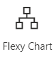
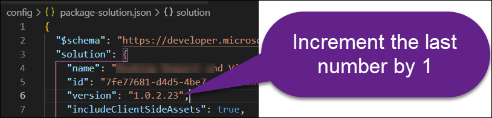

# Flexy Chart SharePoint Framework Webpart

## Quick Deployment
- Download the latest package from [Releases](#X)
- Upload the package to the App Catalog
- Add the webpart to a page


This project is built with [SharePoint Framework](https://docs.microsoft.com/en-us/sharepoint/dev/spfx/sharepoint-framework-overview), [React](https://reactjs.org) and [TypeScript](https://www.typescriptlang.org/). 


## Preparing a Developer's Workstation
1.  Download and install node.js: [node-v14.19.1-x64.msi](https://nodejs.org/dist/v14.19.1/node-v14.19.1-x64.msi) 
1.  Download and install git for Windows: [64-bit Git for Windows Setup](https://github.com/git-for-windows/git/releases/download/v2.31.1.windows.1/Git-2.31.1-64-bit.exe).
1. Install [Visual Studio Code](https://code.visualstudio.com/).
1. Run the following command to install [Gulp](https://gulpjs.com/):
```
npm install --global gulp@4.0.2
```

11. Run this command to install project's dependencies:
```
npm install
```
12. Run this command to install the developer certificate:
```
gulp trust-dev-cert
```
13. Run this command to open the project using Visual Studio code:
```
code .
```


## Important Study Materials for Developers
The topics are listed in the exact order you need to study them. if you already know basics of a given topic - just skip it and move on to the next one. Note that if you are not familiar with one or more of these, it might be difficult to maintain this project. If none of these topics sound familiar, take a few days or even weeks to study them. then come back and attempt to perform code changes.

- [Learn git in 15 minutes. Video on YouTube](https://www.youtube.com/watch?v=USjZcfj8yxE)
- [Introduction to Azure DevOps](https://www.youtube.com/watch?v=JhqpF-5E10I)
- [What is npm? In 2 minutes - npm tutorial for beginners](https://www.youtube.com/watch?v=ZNbFagCBlwo)
- [Gulp (Gulp.js) Tutorial for Beginners - 1 - Download and Installing npm](https://www.youtube.com/watch?v=CxM1RYnCYwM)
- [Learn Sass In 20 Minutes | Sass Crash Course](https://www.youtube.com/watch?v=Zz6eOVaaelI)
- [ES6 Tutorial: Learn Modern JavaScript in 1 Hour](https://www.youtube.com/watch?v=NCwa_xi0Uuc)
- [JavaScript Async Await](https://www.youtube.com/watch?v=V_Kr9OSfDeU)
- [JavaScript ES6 Arrow Functions Tutorial](https://www.youtube.com/watch?v=h33Srr5J9nY)
- [TypeScript Course for Beginners 2021 - Learn TypeScript from Scratch!](https://www.youtube.com/watch?v=BwuLxPH8IDs)
- [React Typescript Tutorial](https://www.youtube.com/watch?v=Z5iWr6Srsj8)
- [Create a SharePoint Online App/Add-in Catalog](https://www.youtube.com/watch?v=qU08CINn4gU)
- [Get started with the SharePoint Framework](https://docs.microsoft.com/en-us/learn/modules/sharepoint-spfx-get-started/)
- [SharePoint Framework Tutorial 1 - HelloWorld WebPart](https://www.youtube.com/watch?v=_O2Re5uRLoo)

## Making changes in the source code
Every time you attempt to make any source code changes, make sure you pull the latest version of the source code by running this command:

```
git pull
```
> If you don't pull the changes from the source control before you start making changes, the code on your workstation might be outdated. Remember: you are not the only person who can make changes to the source code. Don't assume the code on your computer is "the source of truth".

## 👉 DO NOT USE THE BRAVE BROWSER 👈

- Now run the following command to make sure http://localhost:4321/temp/manifests.js is accessible during the development:
```
set NODE_NO_HTTP2=1
```

- Now run the following command to "serve" the project:

```
npm run serve
```

- Wait for the command to finish. It might take 1-2 minutes.
- Open the [Hosted Workbench](https://contoso.sharepoint.com/sites/test/_layouts/15/workbench.aspx).
- Click 
- Add MS Program Chart webpart: 


### Tips about the source code

In your Visual Studio Code, open the `/src/webparts/` folder. It contains all code related to the webpart.

> CSS styles for the project are stored in the `....module.scss` files.

- Now change some code in a .tsx and save it.
- Notice how the hosted workbench automatically refreshes to show you the code changes you've made.


## Building a new Package

### Increase the package version!
Before you attempt to build a new package, make sure you mark it with a version number higher than the previous package's version:

- Open `\config\package-solution.json` file:


- Locate the `Solution` > `Version` property:



- Increment the version by one. For example, if the current version is `1.0.2.23`, replace it with `1.0.2.24`.

Run the following command to package the project:

```
gulp build
gulp bundle
gulp package-solution
```
As a result of running this command, a `.sppkg` file will be generated inside the `\program-chart\sharepoint\solution` folder;


- Open the App Catalog;


- Click 

- Select the .sppkg file and click OK:


- Check-in the newly uploaded .sppkg package:


### Save Your Work in Source Control

It is crucial you save your changes in the source control. This way other developers who need to maintain this project will be able to automatically take your changes. 

After you are done with your changes, run these commands to save your work:

```
git add .
git commit -m "Sample comment describing what I did"
git push
```
